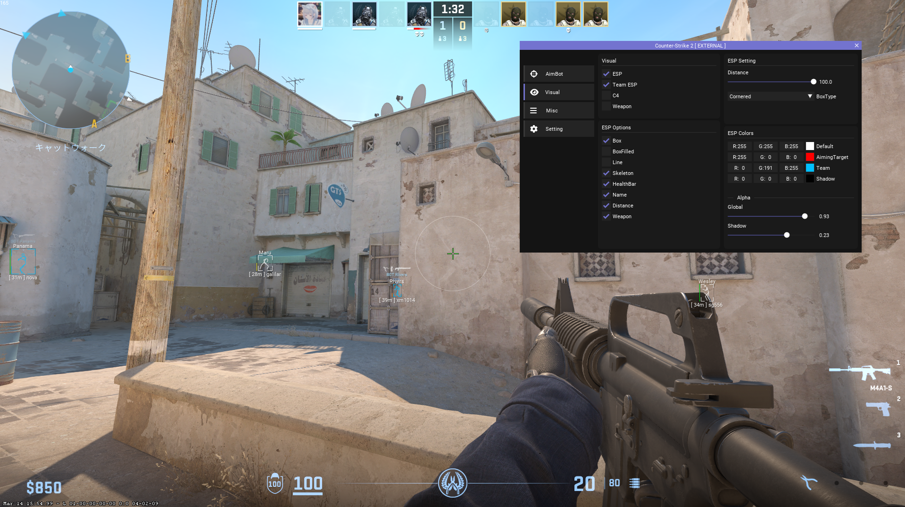
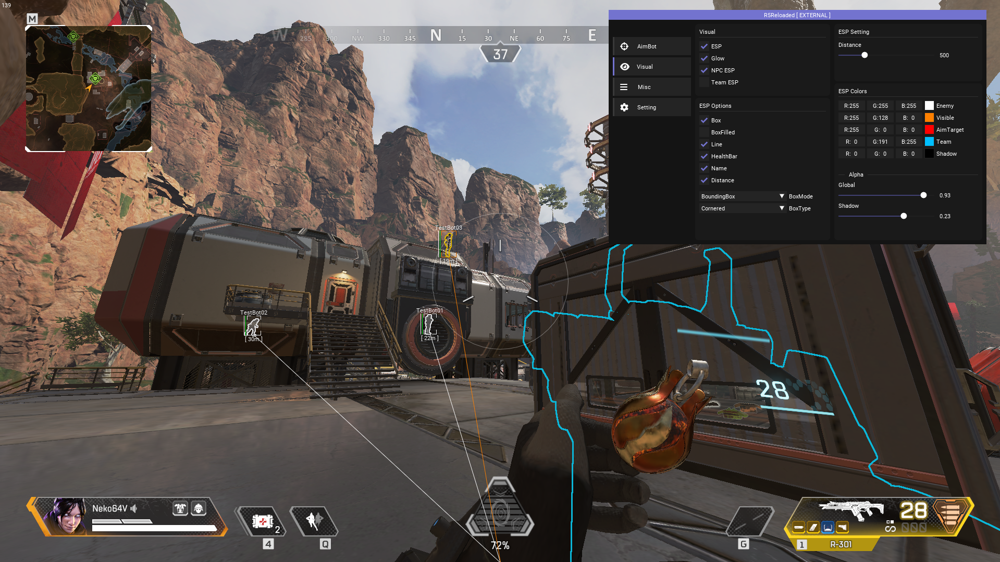

# 概要・定義
本ドキュメントではチートを「FPSゲームにおいて開発者が想定していない不正な外部のソフトウェアやディバイスといったものを使用して他のプレイヤーに対し不正に優位に立つこと」と定義し、それらを使用するプレイヤーのことを「チーター (Cheater)」という。  
言わずもがな、対人FPSゲームの誕生から現代に至るまで、正規のゲーマーに最も嫌われる行為の1つである。

## 実際のチート
※ いずれもローカルのオフラインサーバーで撮影

###  Counter-Strike 2
基本的なESPとメニュー

### ApexLegends
中心にAimBot用の円や左側にチートが持つ独自のメニューがある。

### Escape from Tarkov
敵の種類や脱出口等が表示されている。
