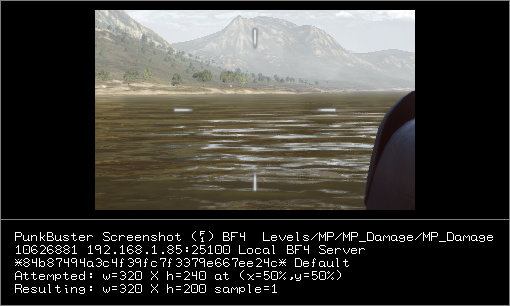
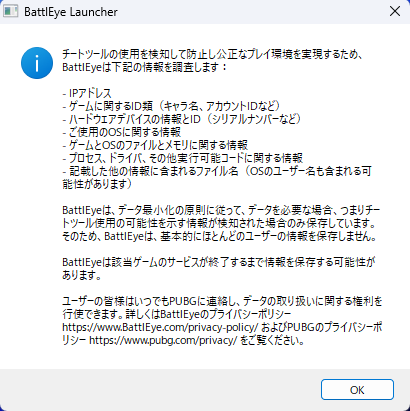

# アンチチートの役割

## 目的と役割
アンチチートは文字通り”対チート”、ゲームの公平性を保つために導入されています。  
役割については大雑把に以下の3つに分類されます。

1. チートの抑止
2. チートの検出
3. チートの追跡/調査

### 1. チートの抑止
「抑止」といってもいくつかニュアンスがあります。  

* PCが基準を満たした環境であるか  
例えばRiot Vanguardであると、脆弱性を多く含みサポートも非常に手間であるという観点からバージョン1909以前のWindows10や、Windows7/8/8.1等のOSをサポートしていません。これらはゲームの起動前にアンチチートに識別されゲームの起動が許可されません。  
また、セキュアブートやIOMMUと言ったその他セキュリティ機能のをオンをユーザーに強制しよりセキュアな環境でゲームをプレイさせることを強要します。

* 検出されたチート/技術の阻止  
例えば、脆弱であったりチートの一部として使用可能なカーネルドライバ等がPC内にロードされているとEACの場合はゲームの起動を拒否します。確かVanguardだとそもそもロードさせないはず。

* チート開発者により高い技術を要求する  
高度なアンチチートの導入により、チート開発者に対してアンチチートが使用する以上のより高い技術を要求し、経験の浅い開発者やそもそもコピーとペーストしかできない無能なチート開発者を締め出すことができます。

### 2. チートの検出
文字通り、実行中のチートを検出します。  
従来のソフトウェアとしてのチートだけでなく、コンバーターや最近だとDMAの検出も厳しくなっています。  
不正なDLLインジェクションを検出したり、Win32APIの各関数をフック、syscallを監視するなどいろいろやっています。  
また、アンチチートによってはスクリーンショットを撮影することもあります。  

Battlerield 4 - PunkBusterによるスクリーンショット  

### 3. チートの追跡/調査
チートの証拠や痕跡を収集し、今後対策を強化する上での情報として活かします。

## サーバーサイドアンチチート
クライアント側にアンチチートが導入されているのは周知の事実ですが、実際のところサーバー側にもアンチチートが導入されています。
少し前のBattlefirldをプレイしていた人にとっては馴染みのある「FairFight」とかもこれです。  
また、CounterStrikeシリーズやApexLegendsにも名称不明ながらほぼ確実に導入されているでしょう。

これらのサーバー側のアンチチートはチーターが手を加えることができない領域で動作しているので、クライアント側アンチチートと比べると自由度は低いですが無効化されることなくほぼ確実にプレイ環境の保護が可能です。  

基本的にには、クライアントから送られてきた様々なデータを基に、データに異常がないか、他にも例えばあまりに露骨なAimBot（1フレーム以内に90°回転し遠くの敵の頭にエイムを合わせる）などを検出するとかしてます。

## プライバシーに関する懸念
これはちょっとした愚痴なので読まなくても大丈夫です。  

近年の厳格化するアンチチートに言えることですが、インストールされたからと言ってその後ユーザーのPC内で好き勝手していいという訳ではありません。もちろんチートに対抗する上で必要最小限の情報は収集するのは理解しますが、ユーザーのプライバシーは最大限尊重されるべきです。  
チート対策を大義名分に「制御されたルートキット」にならない為にも、倫理的に許容される範囲内での実装や透明性の確保、積極的な情報開示が必要ではないかと筆者は考えます。  
ここで言う「透明性」や「情報開示」の一例として、BattlEyeの初回起動時のように収集/調査する情報をアンチチートとしての役割に支障がない範囲内で開示するものが挙げられます。素晴らしい取り組みで高く評価できます。

