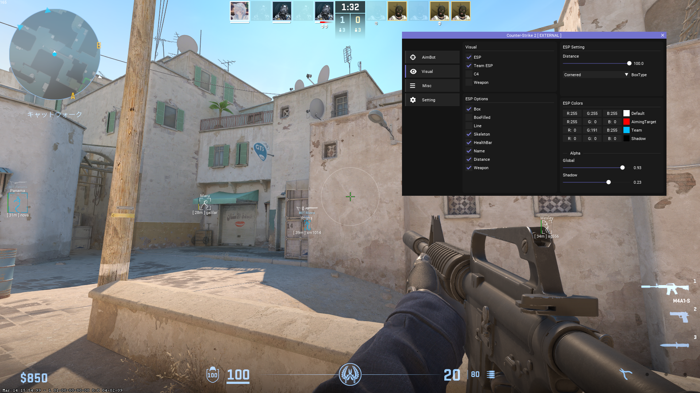
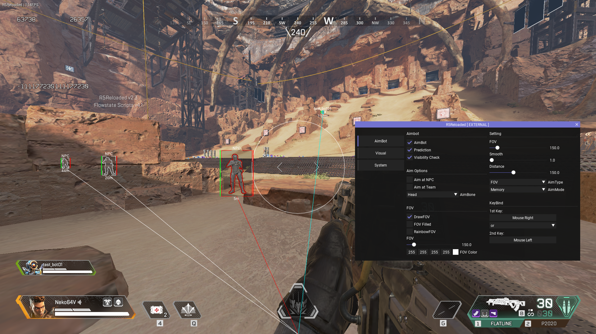
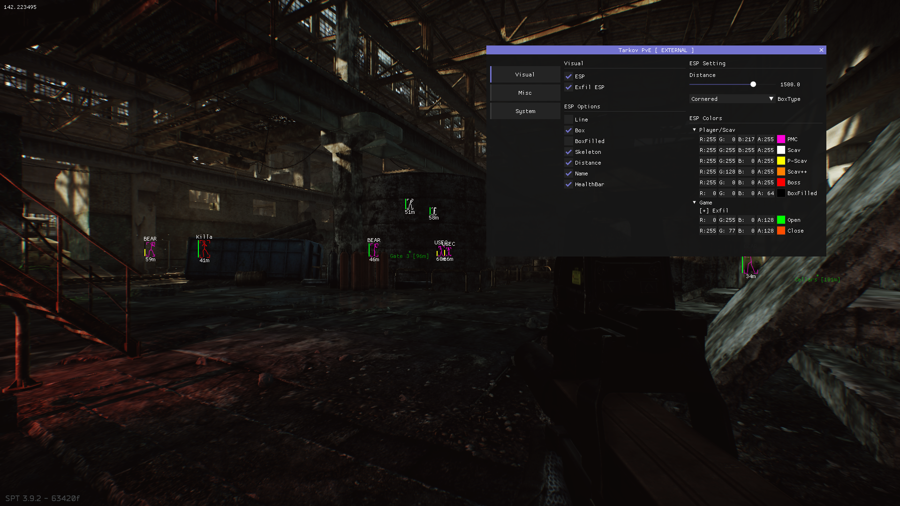

# 概要
FPSゲームでのチート行為とは、FPSゲームにおいて開発者が想定していない不正な外部のソフトウェアやディバイスといったものを使用して他のプレイヤーに対し不正に優位に立つことであり、それらを使用するプレイヤーのことを「チーター (Cheater)」という。
対人FPSゲームの誕生から現代に至るまで、正規のゲーマーに最も嫌われる行為の1つである。

## 定義
上で述べた通り、本ドキュメントではチートを「FPSゲームにおいて開発者が想定していない外部のソフトウェアやディバイスといったものを用いて他のプレイヤーに対し不正に優位に立つこと、またそれに使われるツール」と定義する。

## 実際のチート
※ いずれもローカルのオフラインサーバーで作成/テスト/撮影

###  Counter-Strike 2
基本的なESP

### ApexLegends
中心にAimBot用の円や左側にチートが持つ独自のメニューがある。

### Escape from Tarkov
