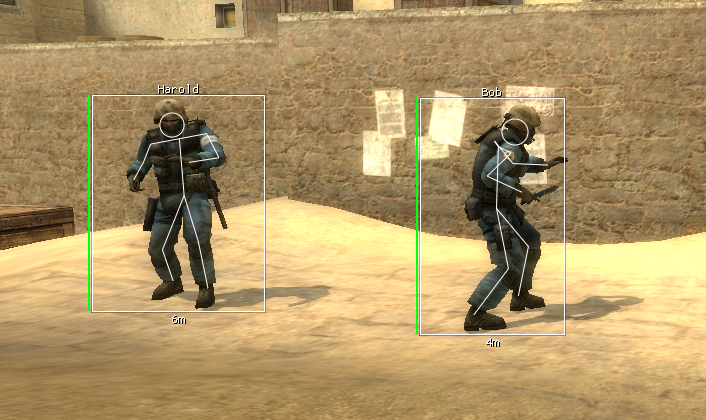

# チートの種類
チートとはいっても様々な種類がある。

## チートにカテゴライズできるが典型的なチートとは異なるもの

### コンバーター
コンバーターとは、キーボードとマウスの信号をコントローラーの信号に変換することで本来のキーボードとマウスではなくゲームパッドでプレイしているとゲーム機本体に誤認させる機器。  
これにより、本来ゲームパッドでしか使用できないエイムアシストをキーボードとマウスで不正に使用することが可能となる。  
一部のコンバーターやソフトウェア型のコンバーターはPCにも対応している為、PCでゲームパッドを使用しているからといってそのプレイヤーがコンバーターを使用していないと断言することはできないので注意が必要。

### マクロ
マクロとは、あらかじめ任意の処理を専用のアプリケーションに記録しておき特定の条件下でその処理を実行するといったもの。  
例えば、マウスの右と左クリックが同時に行われた場合にマウスカーソルを下に動かすといったもの。この場合、射撃を行う際にマウスカーソルがマクロにより自動で下に動くので武器のリコイルコントロールをある程度マクロに任せることが可能になる。  
また、自動で経験値を稼ぐことのできる「AFK Bot / FarmBot」や、音声やゲーム内のテキストチャットやボイスチャットでチートの宣伝を行う比較的高度なものも存在する。

### エイムアシストツール
普通のチートとは異なる仕組みで動作する「エイムアシストツール」なるものも存在する。  
画面上の色を識別しそこに照準を動かす「カラーエイムボット」やAIを使用して画面上の敵を識別してそこに照準を向ける「AIエイムアシスト」といったものがこれに該当。  
通常のAimBotと比較すると精度や挙動が著しく悪い。

### Lag Switch（ラグスイッチ）
2025年現在となっては効果がほぼ無くなり廃れたものであるが一応記載。  
意図的にネットワーク遅延を発生させることにより、無敵時間になったり敵の動きを止めたりするもの。

## 一般的なチート

### ウォールハック
ウォールハック(別名: ESP) とは、プレイヤーの位置やアイテムの位置を画面上に表示する機能である。
ゲームのメモリを書き換えてプレイヤーやアイテムのモデルを光らせたり、敵プレイヤーの画面上の位置を計算してそこに距離や名前、HPなどの各種情報を表示することで機能する。
BattlefieldやCall of Dutyのようなリスポーン可能なゲームでは他のプレイヤーに対し極端に顕著な影響はないが、これらのゲームの一部モードやバトロワ系のゲーム、CounterStrikeやValorantのような爆破系、Escape from Tarkovをはじめとした死亡時に装備を一式ロストしてしまうような取り返しのつかない要素のあるゲームでは、ウォールハックを使用したチーターに対し正規のプレイヤーが極端に不利となる。
マップの状況を常に把握できる為、戦闘の意図的な回避、有利な位置の確保、疲弊したプレイヤーへの攻撃やレアアイテムを真っ先に奪取したりするといったことが可能になる。

### ウォールハックとESPの違い
厳密な定義は存在しないが、筆者はおおよそこんな感じで使い分けてます。
#### ウォールハック
グラフィック周りに細工を行い、ゲームのオブジェクトをレンダリングする順番変えて敵を画面上最上位に来るようにして壁越に敵が見えるようにしたり、敵のモデルを何らかの方法でハイライトしたり光らせたりするやつ。

#### ESP
"Extra Sensory Perception" の略。  
プレイヤーを囲む四角形のBOXやHP、名前や距離といったデータをチート側で視覚化したもの。 

### AimBot
エイムボット(オートエイム) とは、チート使用者が相手プレイヤーに対し自動で照準を合わせることのできる機能。
近年の平均的なチートでは、  

* AimBot自体の強さ
* ターゲットが見えているか
* ターゲットの体のどこを狙うか（頭、胸、腰等々…Boneの数だけ選択肢がある）
* ターゲットが画面上のAimBotが有効になる範囲より内側にいるか
* 弾速や重力、敵までの距離を考慮した偏差

等をはじめとした様々なチェックや機能が存在する。  
これらはチート自体が持つメニューによりユーザーが自由にカスタマイズ可能であり、既に一定のスキルのあるプレイヤーが最適な設定を見つけ出せばあたかもプロのプレイヤーであるかのように振舞うことが可能となる。  
また、エイムボットの派生として、「SilentAim」や「MagicBullet」と呼ばれるものがある。これらは、視点を動かすことなく敵に弾を当てることができるといったもの。一般的に「ホーミング」と呼ばれているものがこれに該当する。MagicBulletの場合は本来弾が貫通しないはずの壁越しでも弾を命中させることが可能。

### TriggerBot
敵プレイヤーが画面の中心に来た時に自動で射撃を行う。  
敵に一瞬でも照準を合わせればいい為、高威力な武器と非常に相性が良く近接戦闘では大きな脅威となる。

### Misc/Exploit
他にも無数にあるので多くは取り上げないが、代表的なものに以下のようなものがある。

* SpinBot
* SpeedHack
* No Recoil/Spread（反動や弾の拡散を抑止）

悪質なものであると他のプレイヤーをサーバーからキックできるものから、クライアントやサーバーごとクラッシュさせてしまうものまで存在する。
ただし、ゲームエンジンやそのゲームで対策済みかどうかによって変わってくるので一概に全てのゲームでこのような機能が使用できるとは限らない。

### StreamProof
OBS Studioをはじめとしたストリーミングソフトウェアにチートが映らなくなる。  
下の動画の場合、右側がオリジナルの画面で左側がストリーミングソフトウェアから見た画面。

